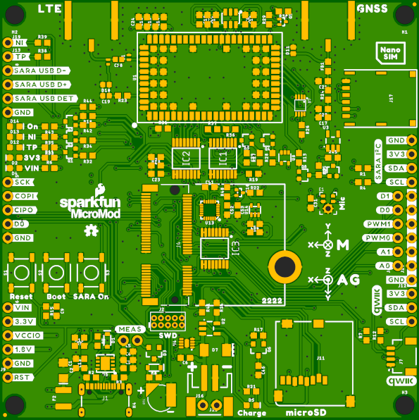
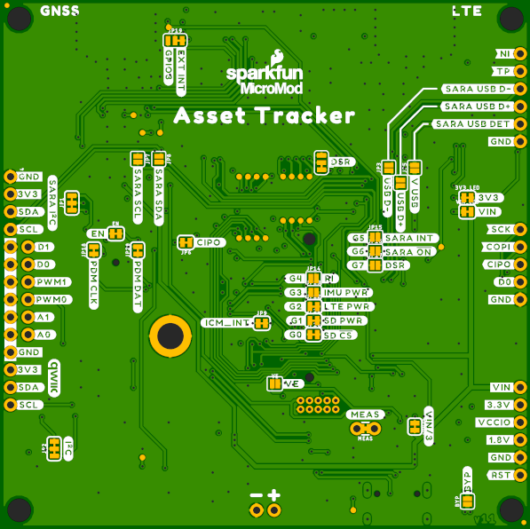
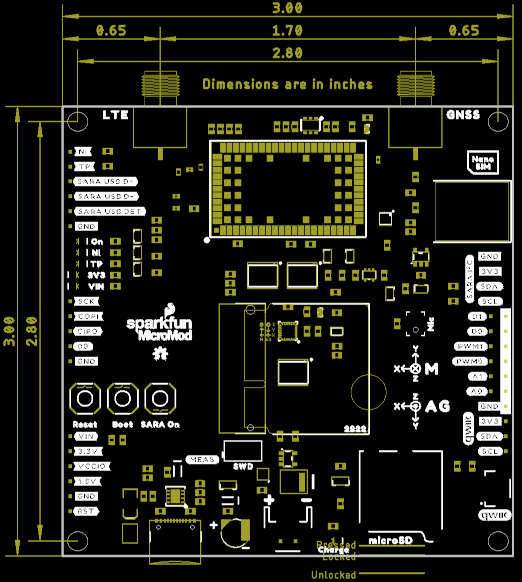

# MicroMod Asset Tracker Carrier Board

A MicroMod carrier board based around the u-blox SARA-R510M8S cellular LTE GNSS combo module, for asset tracking applications.

## Repository Contents

- **/Examples** - A set of examples demonstrating how to use each component on the Asset Tracker. Run these from the Arduino IDE.
- **/Documentation** - Datasheets etc.
- **/Hardware** - Eagle PCB, SCH and LBR design files. Full schematic in PDF format.
- **[LICENSE.md](./LICENSE.md)** - License details

## Arduino Library

- [SparkFun u-blox SARA-R5 Arduino Library](https://github.com/sparkfun/SparkFun_u-blox_SARA-R5_Arduino_Library)
